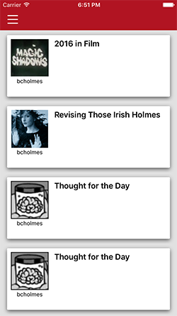
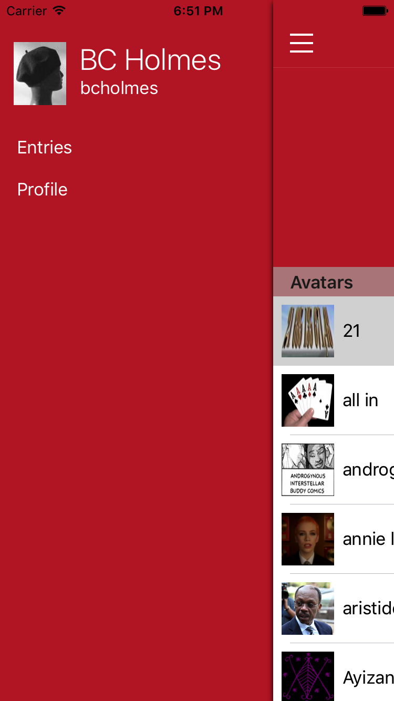
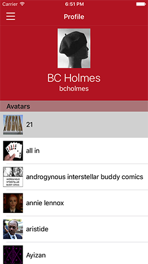

# Dreamwidth App

This codebase implements an App for Dreamwidth. I really like Dreamwidth, and it bugs
me that there's no good App for it. So, I became interested in fixing that. 
Unfortunately, I hit a couple of insurmountable opportunities:

1. The existing APIs for LiveJournal/Dreamwidth have very poor support for fetching 
entries in a most-recent first way (which is the most natural way for mobile apps). 
You can get your own entries most-recent first, but it's hard to get your reading list
most recent first.
2. The existing APIs have no real support for comments.

I've started various conversations with the Dreamwidth folks about supporting new APIs,
but it's taking some time.

In the meantime, this app uses the so-called "flat API".

## Screens

Here are some screenshots of work-in-progress:

  

## Ancient History

The original intention of this codebase was to serve as an implementation of the 
Dreamwidth API written in Objective-C. My plan had been to include Dreamwidth integration 
in another app that I work on, and this code was created as a sandbox to work on those 
features. It's evolved over time.

The primary documentation for the API is part of the LiveJournal site; the same API
works for Dreamwidth.
