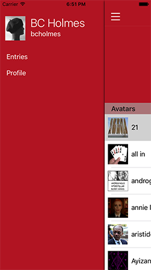

# Dreamwidth App

This codebase implements an iOS App for Dreamwidth. I really like Dreamwidth, and it bugs
me that there's no good App for it. So, I became interested in fixing that.
Unfortunately, I hit a couple of near-insurmountable opportunities:

1. The existing APIs for LiveJournal/Dreamwidth have very poor support for fetching
entries in a most-recent first way (which is the most natural way for mobile apps).
You can get your own entries most-recent first, but it's hard to get your reading list
most recent first.
2. The existing APIs have no real support for comments. There has been
[some progress](https://github.com/dreamwidth/dw-free/pull/2265)
on that front, but a solution is probably a few months off, still.

Getting data from Dreamwidth is complex -- especially if you want to be able to work with the most
common types of data such as comments and the like. I have an approach to [interfacing with Dreamwidth](INTERFACING.md),
but I'm abundantly clear that the interface is messy.

## Items to Be Completed

This list is out-of-date. I'm trying to use issues to manage the outstanding work.

1. ~~Reverse-engineer Dreamwidth's cookie-based session auth~~ DONE! The flat API
allows me to get a session cookie and use that for some requests, turning that session
id into the necessary cookies is pretty terrible.
2. ~~Call the [Mobile Reading Page](https://www.dreamwidth.org/mobile/read) and get the recent Reading List~~ DONE!
3. ~~Fetch each page as format=light and scrape its content.~~ Essentially DONE.
4. ~~Show a fuller entry page, with comments.~~ DONE
5. [Render more complex entry HTML](https://github.com/bcholmes/dreamwidth-ios/issues/6)
6. [Compose a new entry](https://github.com/bcholmes/dreamwidth-ios/issues/7)
7. [Compose a new comment](https://github.com/bcholmes/dreamwidth-ios/issues/11)
8. [Better account settings management](https://github.com/bcholmes/dreamwidth-ios/issues/8)
9. [Notifications](https://github.com/bcholmes/dreamwidth-ios/issues/9)
10. [Refresh content on a reasonable schedule](https://github.com/bcholmes/dreamwidth-ios/issues/10)
11. [Apple will almost-certainly insist that I exclude all of the NSFW content. I have a plan for this; I just need to fiddle with the details.](https://github.com/bcholmes/dreamwidth-ios/issues/4)

## Other Items to be Resolved

I'm a long-time Dreamwidth paid member, and as a result, I'm not required to see ads, and I get fairly speedy servers. Dreamwidth has a free model that is subsidized by ads, and if people using the app can avoid seeing the ads, then Dreamwidth's corporate masters might not like the mobile app. At some point, I'll probably need to have a conversation with them.

## Screens

~~Here are some screenshots of work-in-progress~~ Wow, these screenshots are out-of-date:

   

## Building the Code

If you want to build this code, you'll need to:

1. Install [CocoaPods](https://cocoapods.org/)
2. Clone this code
3. Run `pod install` in the code source directory
4. Open the dreamwidth.xcworkspace file in XCode (**not** the dreamwidth/dreamwidth.xcodeproj)

## Ancient History

The original intention of this codebase was to serve as an implementation of the
Dreamwidth API written in Objective-C. My plan had been to include Dreamwidth integration
in another app that I work on, and this code was created as a sandbox to work on those
features. It's evolved over time.

The primary documentation for the API is part of the LiveJournal site; the same API
works for Dreamwidth.
